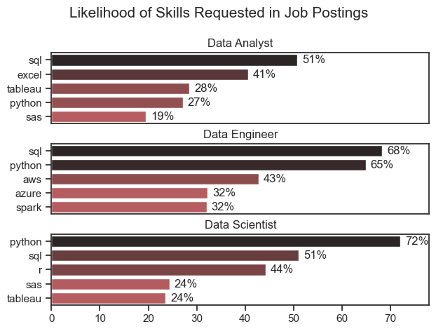
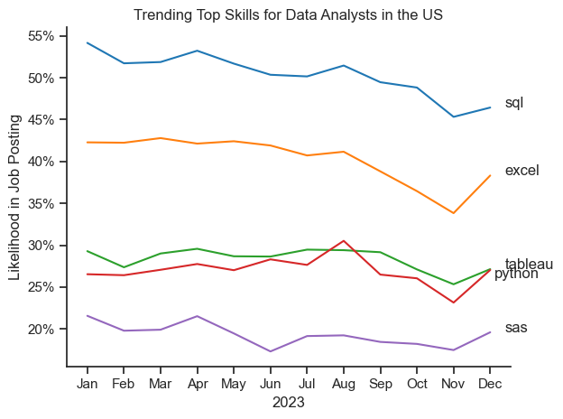
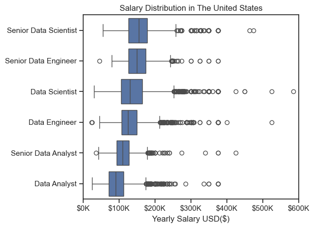

# The Analysis

## 1. What are the most demanded skills for the top 3 popular data roles?

To identify the most in-demand skills, the top three most commonly posted data job roles were filtered based on job listing frequency. For each role, the five most frequently mentioned skills were extracted to get a better idea of what employers are really looking for. This makes it easier to focus on the right skills depending on the role being targeted.

Detailed steps and analysis can be found in the notebook: [2_Skill_Demand.ipynb](2_Project\2_Skill_Demand.ipynb)

### Visualizing Data
```python
fig, ax = plt.subplots(len(job_titles), 1)

for i, job_title in enumerate(job_titles):
    df_plot = df_skills_perc[df_skills_perc['job_title_short']==job_title].head(5)
    sns.barplot(data=df_plot, y='job_skills',x='skills_percentage', ax=ax[i], hue='skills_percentage', palette='dark:r_r')
    sns.set_theme(style='ticks')
    ax[i].set_title(job_title)
    ax[i].set_ylabel('')
    ax[i].set_xlabel('')
    ax[i].legend().remove()
    ax[i].set_xlim(0, 78)

    for n, v in enumerate(df_plot['skills_percentage']):
        ax[i].text(v + 1, n, f'{v:.0f}%', va = 'center')
    
    if i != len(job_titles) -1:
        ax[i].set_xticks([])
    
plt.suptitle('Likelihood of Skills Requested in Job Postings', fontsize = 15)
plt.tight_layout(h_pad=0.5)
plt.show()
```

### Results



*Visualization of Most In-Demand skills of Top Data Roles.*

### Insights

#### *Core Skills Across All Roles*

**✅ SQL is the most consistently in-demand skill, appearing prominently for all three roles:**

* 51% for Analysts, 68% for Engineers, and 51% for Scientists.

**Python is essential across the board:**

* Particularly dominant in Data Science (72%) and Engineering (65%), and still relevant for Analysts (27%).

**These two skills (SQL + Python) form the foundational technical stack for data professionals.**


**📊 Data Analyst – Focus on Business Tools & Reporting**


* Strong emphasis on Excel (41%) and Tableau (28%), showing the importance of data visualization and reporting.

* Lower demand for advanced programming (Python 27%) and statistical tools (SAS 19%).

* *Key Takeaway: Analysts often serve as the bridge between data and business, relying more on tools that enable communication and insight presentation.*


**🛠️ Data Engineer – Focus on Infrastructure & Scalability**


*Strong technical requirements:*

* SQL (68%) and Python (65%) dominate

* Cloud platforms like AWS (43%) and Azure (32%)

* Big data tools like Spark (32%)

*Engineers need skills in data pipelines, cloud infrastructure, and distributed systems.*

*Key Takeaway: Data Engineers are builders, needing both programming and cloud ecosystem knowledge to manage large-scale data systems.*


**🧪 Data Scientist – Focus on Modeling & Analytics**


* Python (72%) is the top skill, showing its dominance in data science workflows

* R (44%) is notable for statistical modeling and research-heavy roles

* SQL (51%) remains important for querying data

* Tools like SAS (24%) and Tableau (24%) are less critical, but still present

*Key Takeaway: Data Scientists require strong programming and statistical skills to extract insights, build models, and contribute to decision-making.*


## 1. How are in-demand Skills trending for Data Analysts?

### Visualizing Data

``` python

df_plot = df_DA_US_percent.iloc[:, :5]
sns.set_theme(style='ticks')
sns.lineplot(data=df_plot, dashes = False, palette='tab10')
sns.despine()

plt.title('Trending Top Skills for Data Analysts in the US')
plt.ylabel('Likelihood in Job Posting')
plt.xlabel('2023')
plt.legend().remove()


from matplotlib.ticker import PercentFormatter
plt.gca().yaxis.set_major_formatter(PercentFormatter(decimals=0))

plt.text(11.4, df_plot.iloc[-1, 0],df_plot.columns[0])
plt.text(11.4, df_plot.iloc[-1, 1],df_plot.columns[1])
plt.text(11.4, df_plot.iloc[-1, 2],df_plot.columns[2])
plt.text(11.1, df_plot.iloc[-3, 3],df_plot.columns[3])
plt.text(11.4, df_plot.iloc[-1, 4],df_plot.columns[4])

plt.tight_layout()
plt.show()

```

### Results



*Linegraph Visualizing the trending top skills for Data Analysts in the US in 2023.*

### Insights

* SQL remains the most in-demand skill throughout the year, maintaining above 50% likelihood in job postings, though slightly dipping in Q4.

* Excel stays consistently important, showing a steady presence around 40–42%, with a small dip in October–November and a bounce back in December.

* Tableau and Python trend closely together, with Tableau slightly leading for most of the year, except a crossover in late summer.

* Python maintains stable demand around 26–29%, showing its consistent value across the year.

* SAS remains the least requested skill, with likelihood hovering around 20%, showing a steady but lower relevance in the market.

**📈 Notable Changes**

* Excel shows a noticeable dip in October–November, possibly due to a shift in reporting tools or role requirements late in the year.

* August sees a temporary spike in Tableau demand, suggesting increased need for data visualization during that period.

* Python and Tableau converge in Q4, showing that either tool could be valuable depending on the job listing.

## 2. How well do Jobs and Skills pay for Data Analysts?

### Salary Analysis for Data Roles

### Visualizing Data

```python

sns.boxplot(data=df_US_top6, x='salary_year_avg',y='job_title_short', order=job_order)
sns.set_theme(style='ticks')

plt.title('Salary Distribution in The United States')
plt.ylabel('')
plt.xlabel('Yearly Salary USD($)')
plt.xlim(0,600000)
ticks_x = plt.FuncFormatter(lambda y, pos: f'${int(y/1000)}K')
plt.gca().xaxis.set_major_formatter(ticks_x)
plt.show()

 ```

 ### Results

 

*Boxplot visualizing the salary distribution for the top 6 data job titles.*

**📊 Role-wise Insights**

***🔹Data Analyst***

* Has the lowest median salary among all roles.

* Most salaries fall between $70K and $110K, with a few outliers reaching ~$250K.

***🔹Senior Data Analyst***

* Median salary is higher than Data Analyst but lower than most other senior roles.

* Salaries typically range from $90K to $140K.

* Still includes notable outliers reaching over $250K.

***🔹Data Engineer*** 
* Median salary is slightly higher than a Data Scientist.

* Most salaries are between $100K and $150K, with outliers up to $500K.

***🔹Data Scientist***

* Median salary is comparable to a Data Engineer.

* Distribution is slightly wider, showing more variance in pay.

***🔹Senior Data Engineer***

* One of the highest median salaries, typically around $150K–$170K.

* High number of outliers above $250K, some even exceeding $400K.

***🔹Senior Data Scientist***

* Has the highest median salary overall.

* Salary range is wide: mostly between $140K and $190K, with top outliers pushing beyond $500K.

**📈 Overall Takeaways**

* Senior Data Scientist and Senior Data Engineer roles are the top-paying positions.

* Engineering and Science roles tend to pay more than Analyst roles, especially at senior levels.

* There's a significant presence of outliers across all roles, suggesting some exceptionally high-paying positions exist.

### Highest Paid & Most Demanded Skills for Data Analysts

### Visualizing Data

```python
sns.set_theme(style='ticks')

fig, ax = plt.subplots(2,1)
sns.barplot(data=df_DA_Top_Pay, x='median',y=df_DA_Top_Pay.index,ax= ax[0], hue='median', palette='dark:b_r')
ax[0].legend().remove()
ax[0].set_title('Top 10 Highest paid skills for Data Analysts')
ax[0].set_xlabel(' ')
ax[0].set_ylabel(' ')
ax[0].xaxis.set_major_formatter(plt.FuncFormatter(lambda x, i: f'${int(x/1000)}K'))

sns.barplot(data=df_DA_Top_Skills,x='median',y=df_DA_Top_Skills.index,ax=ax[1],hue ='median',palette='dark:r_r')
ax[1].legend().remove()
ax[1].set_title('Top 10 in-demand skills for Data Analysts')
ax[1].set_xlabel(' ')
ax[1].set_ylabel(' ')
ax[1].xaxis.set_major_formatter(plt.FuncFormatter(lambda x, i: f'${int(x/1000)}K'))

plt.xlim(0, 200000)
fig.tight_layout()
```

### Results


*Two Seperate Bar Graphs Visualizing the Highest paid skills and most In-Demand skills for Data Analysts in the US*

### Insights 

* High-paying skills such as dplyr, bitbucket, gitlab, and solidity are not among the most commonly requested ones. This suggests that less common or niche tools—especially those related to programming workflows, version control, blockchain, or cutting-edge platforms like Hugging Face—can command higher salaries due to their specialized nature and lower supply of skilled professionals.

* On the other hand, the most in-demand skills like python, tableau, r, sql, and excel are more foundational or widely used tools in typical data analyst roles. These skills are essential for entering the field, but they may not always lead to the highest salaries, likely due to high supply and broader adoption across industries.

* Tools like power bi, sas, and powerpoint show that employers still value business intelligence and reporting capabilities, reinforcing the importance of communication and visualization skills in analyst roles.

* The contrast between the two charts highlights a valuable takeaway: developing niche or emerging technical skills (e.g., hugging face, couchbase, mxnet) may open doors to higher-paying roles, while mastering core tools (like python, sql, excel) remains critical for landing jobs and staying relevant in the job market.