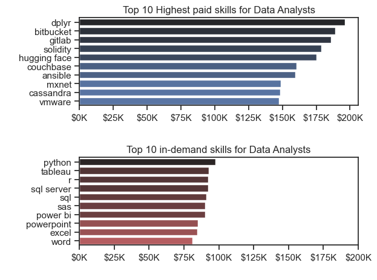

# Overview

This analysis explores the current landscape of the data job market, with a particular focus on roles related to data analysts. Designed to gain clearer insights into industry expectations, the project highlights the skills that are both highly sought after and well-compensated. By identifying where demand meets opportunity, it aims to guide aspiring and current data analysts toward career decisions that align with market trends.

The dataset, originally curated for [Luke Barousse's](https://github.com/lukebarousse) Python course, serves as the backbone of this study. It includes comprehensive details on job titles, salary ranges, geographic distribution, and technical skill requirements. Using Python-based data analysis, this project addresses core questions such as which skills lead to better pay, which are most frequently requested, and how professionals can position themselves for the most strategic roles in the data analytics field.

# The Questions

The following questions were answered in this project:

1. What are the skills most in demand for the top 3 most popular data roles?
2. How are in-demand skills trending for Data Analysts?
3. How well do jobs and skills pay for Data Analysts?
4. What are the optimal skills for data analysts to learn? (High Demand AND High Paying)

# Tools & Technologies Used in the Analysis

* **Python**: The core programming language used to process and analyze the dataset.

*Libraries*
* **Pandas**: Utilized for data cleaning, transformation, and in-depth analysis.

* **Matplotlib**: Used to create basic visualizations and explore data distributions.

* **Seaborn**: Helped generate more advanced and visually appealing charts.

*Tools & Technologies*

* **Jupyter Notebooks**: Provided an interactive environment to combine code, analysis, and commentary in one place.

* **Visual Studio Code**: Used for writing and managing Python scripts in a more structured development setup.

* **Git & GitHub**: Enabled version control and project collaboration, and served as a platform to host and share the codebase.

#  Data Preparation and Cleaning

Before diving into analysis, the dataset was carefully prepared to ensure reliability and relevance. This stage involved importing necessary libraries, loading the raw dataset, and performing initial cleaning to structure the data for further exploration.

## Importing and Preparing the Dataset

The first step was to import essential Python libraries for data handling and visualization

``` python
import pandas as pd
import ast
import seaborn as sns
import matplotlib.pyplot as plt
from datasets import load_dataset
```

The dataset was then loaded using Hugging Face’s load_dataset function and converted into a Pandas DataFrame for ease of manipulation:

``` python
dataset = load_dataset('lukebarousse/data_jobs')
df = dataset['train'].to_pandas()
```

## Cleaning and Structuring Data

* The job_posted_date column was converted into datetime format for time-based analysis.

* The job_skills column, originally in string format, was safely converted to Python lists using ast.literal_eval():

``` python
df['job_posted_date'] = pd.to_datetime(df['job_posted_date'])

df['job_skills'] = df['job_skills'].apply(lambda x: ast.literal_eval(x) if pd.notna(x) else x)
```

Method 2 (Converting String to List) - Defined a Function

``` python
def cleaned_list(skills_list):
    if pd.notna(skills_list):
        return ast.literal_eval(skills_list)

df['job_skills'] = df['job_skills'].apply(cleaned_list)
```


# The Analysis

## 1. What are the most demanded skills for the top 3 popular data roles?

To identify the most in-demand skills, the top three most commonly posted data job roles were filtered based on job listing frequency. For each role, the five most frequently mentioned skills were extracted to get a better idea of what employers are really looking for. This makes it easier to focus on the right skills depending on the role being targeted.

Detailed steps and analysis can be found in the notebook: [2_Skill_Demand.ipynb](2_Project\2_Skill_Demand.ipynb)

### Visualizing Data
```python
fig, ax = plt.subplots(len(job_titles), 1)

for i, job_title in enumerate(job_titles):
    df_plot = df_skills_perc[df_skills_perc['job_title_short']==job_title].head(5)
    sns.barplot(data=df_plot, y='job_skills',x='skills_percentage', ax=ax[i], hue='skills_percentage', palette='dark:r_r')
    sns.set_theme(style='ticks')
    ax[i].set_title(job_title)
    ax[i].set_ylabel('')
    ax[i].set_xlabel('')
    ax[i].legend().remove()
    ax[i].set_xlim(0, 78)

    for n, v in enumerate(df_plot['skills_percentage']):
        ax[i].text(v + 1, n, f'{v:.0f}%', va = 'center')
    
    if i != len(job_titles) -1:
        ax[i].set_xticks([])
    
plt.suptitle('Likelihood of Skills Requested in Job Postings', fontsize = 15)
plt.tight_layout(h_pad=0.5)
plt.show()
```

### Results


*Visualization of Most In-Demand skills of Top Data Roles.*

### Insights

#### *Core Skills Across All Roles*

**✅ SQL is the most consistently in-demand skill, appearing prominently for all three roles:**

* 51% for Analysts, 68% for Engineers, and 51% for Scientists.

**Python is essential across the board:**

* Particularly dominant in Data Science (72%) and Engineering (65%), and still relevant for Analysts (27%).

**These two skills (SQL + Python) form the foundational technical stack for data professionals.**


**📊 Data Analyst – Focus on Business Tools & Reporting**


* Strong emphasis on Excel (41%) and Tableau (28%), showing the importance of data visualization and reporting.

* Lower demand for advanced programming (Python 27%) and statistical tools (SAS 19%).

* *Key Takeaway: Analysts often serve as the bridge between data and business, relying more on tools that enable communication and insight presentation.*


**🛠️ Data Engineer – Focus on Infrastructure & Scalability**


*Strong technical requirements:*

* SQL (68%) and Python (65%) dominate

* Cloud platforms like AWS (43%) and Azure (32%)

* Big data tools like Spark (32%)

*Engineers need skills in data pipelines, cloud infrastructure, and distributed systems.*

*Key Takeaway: Data Engineers are builders, needing both programming and cloud ecosystem knowledge to manage large-scale data systems.*


**🧪 Data Scientist – Focus on Modeling & Analytics**


* Python (72%) is the top skill, showing its dominance in data science workflows

* R (44%) is notable for statistical modeling and research-heavy roles

* SQL (51%) remains important for querying data

* Tools like SAS (24%) and Tableau (24%) are less critical, but still present

*Key Takeaway: Data Scientists require strong programming and statistical skills to extract insights, build models, and contribute to decision-making.*


## 2. How are in-demand Skills trending for Data Analysts?

Detailed steps and analysis can be found in the notebook: [3_Skills_Trend](2_Project/3_Skills_Trend.ipynb)

### Visualizing Data

``` python

df_plot = df_DA_US_percent.iloc[:, :5]
sns.set_theme(style='ticks')
sns.lineplot(data=df_plot, dashes = False, palette='tab10')
sns.despine()

plt.title('Trending Top Skills for Data Analysts in the US')
plt.ylabel('Likelihood in Job Posting')
plt.xlabel('2023')
plt.legend().remove()


from matplotlib.ticker import PercentFormatter
plt.gca().yaxis.set_major_formatter(PercentFormatter(decimals=0))

plt.text(11.4, df_plot.iloc[-1, 0],df_plot.columns[0])
plt.text(11.4, df_plot.iloc[-1, 1],df_plot.columns[1])
plt.text(11.4, df_plot.iloc[-1, 2],df_plot.columns[2])
plt.text(11.1, df_plot.iloc[-3, 3],df_plot.columns[3])
plt.text(11.4, df_plot.iloc[-1, 4],df_plot.columns[4])

plt.tight_layout()
plt.show()

```

### Results


*Linegraph Visualizing the trending top skills for Data Analysts in the US in 2023.*

### Insights

* SQL remains the most in-demand skill throughout the year, maintaining above 50% likelihood in job postings, though slightly dipping in Q4.

* Excel stays consistently important, showing a steady presence around 40–42%, with a small dip in October–November and a bounce back in December.

* Tableau and Python trend closely together, with Tableau slightly leading for most of the year, except a crossover in late summer.

* Python maintains stable demand around 26–29%, showing its consistent value across the year.

* SAS remains the least requested skill, with likelihood hovering around 20%, showing a steady but lower relevance in the market.

**📈 Notable Changes**

* Excel shows a noticeable dip in October–November, possibly due to a shift in reporting tools or role requirements late in the year.

* August sees a temporary spike in Tableau demand, suggesting increased need for data visualization during that period.

* Python and Tableau converge in Q4, showing that either tool could be valuable depending on the job listing.

## 3. How well do Jobs and Skills pay for Data Analysts?

Detailed steps and analysis can be found in the notebook: [4_Salary_Analysis](2_Project/4_Salary_Analysis.ipynb)

### Salary Analysis for Data Roles

### Visualizing Data

```python

sns.boxplot(data=df_US_top6, x='salary_year_avg',y='job_title_short', order=job_order)
sns.set_theme(style='ticks')

plt.title('Salary Distribution in The United States')
plt.ylabel('')
plt.xlabel('Yearly Salary USD($)')
plt.xlim(0,600000)
ticks_x = plt.FuncFormatter(lambda y, pos: f'${int(y/1000)}K')
plt.gca().xaxis.set_major_formatter(ticks_x)
plt.show()

 ```

 ### Results

 

*Boxplot visualizing the salary distribution for the top 6 data job titles.*

**📊 Role-wise Insights**

***🔹Data Analyst***

* Has the lowest median salary among all roles.

* Most salaries fall between $70K and $110K, with a few outliers reaching ~$250K.

***🔹Senior Data Analyst***

* Median salary is higher than Data Analyst but lower than most other senior roles.

* Salaries typically range from $90K to $140K.

* Still includes notable outliers reaching over $250K.

***🔹Data Engineer*** 
* Median salary is slightly higher than a Data Scientist.

* Most salaries are between $100K and $150K, with outliers up to $500K.

***🔹Data Scientist***

* Median salary is comparable to a Data Engineer.

* Distribution is slightly wider, showing more variance in pay.

***🔹Senior Data Engineer***

* One of the highest median salaries, typically around $150K–$170K.

* High number of outliers above $250K, some even exceeding $400K.

***🔹Senior Data Scientist***

* Has the highest median salary overall.

* Salary range is wide: mostly between $140K and $190K, with top outliers pushing beyond $500K.

**📈 Overall Takeaways**

* Senior Data Scientist and Senior Data Engineer roles are the top-paying positions.

* Engineering and Science roles tend to pay more than Analyst roles, especially at senior levels.

* There's a significant presence of outliers across all roles, suggesting some exceptionally high-paying positions exist.

### Highest Paid & Most Demanded Skills for Data Analysts

### Visualizing Data

```python
sns.set_theme(style='ticks')

fig, ax = plt.subplots(2,1)
sns.barplot(data=df_DA_Top_Pay, x='median',y=df_DA_Top_Pay.index,ax= ax[0], hue='median', palette='dark:b_r')
ax[0].legend().remove()
ax[0].set_title('Top 10 Highest paid skills for Data Analysts')
ax[0].set_xlabel(' ')
ax[0].set_ylabel(' ')
ax[0].xaxis.set_major_formatter(plt.FuncFormatter(lambda x, i: f'${int(x/1000)}K'))

sns.barplot(data=df_DA_Top_Skills,x='median',y=df_DA_Top_Skills.index,ax=ax[1],hue ='median',palette='dark:r_r')
ax[1].legend().remove()
ax[1].set_title('Top 10 in-demand skills for Data Analysts')
ax[1].set_xlabel(' ')
ax[1].set_ylabel(' ')
ax[1].xaxis.set_major_formatter(plt.FuncFormatter(lambda x, i: f'${int(x/1000)}K'))

plt.xlim(0, 200000)
fig.tight_layout()
```

### Results



*Two Seperate Bar Graphs Visualizing the Highest paid skills and most In-Demand skills for Data Analysts in the US*

### Insights 

* High-paying skills such as dplyr, bitbucket, gitlab, and solidity are not among the most commonly requested ones. This suggests that less common or niche tools—especially those related to programming workflows, version control, blockchain, or cutting-edge platforms like Hugging Face—can command higher salaries due to their specialized nature and lower supply of skilled professionals.

* On the other hand, the most in-demand skills like python, tableau, r, sql, and excel are more foundational or widely used tools in typical data analyst roles. These skills are essential for entering the field, but they may not always lead to the highest salaries, likely due to high supply and broader adoption across industries.

* Tools like power bi, sas, and powerpoint show that employers still value business intelligence and reporting capabilities, reinforcing the importance of communication and visualization skills in analyst roles.

* The contrast between the two charts highlights a valuable takeaway: developing niche or emerging technical skills (e.g., hugging face, couchbase, mxnet) may open doors to higher-paying roles, while mastering core tools (like python, sql, excel) remains critical for landing jobs and staying relevant in the job market.


## 4. What is the Most Optimal Skill to Learn for Data Analysts?

Detailed steps and analysis can be found in the notebook: [5_Optimal_Skills](2_Project/5_Optimal_Skills.ipynb)

### Visualizing Data

**Chart 1**

``` python 
from adjustText import adjust_text
from matplotlib.ticker import PercentFormatter

df_DA_skills_high_demand.plot(kind='scatter', y='median_salary', x='skill_percent')

texts = [] #Created a list and appending as below to use adjust_text

for i, txt in enumerate(df_DA_skills_high_demand.index): 
    texts.append(plt.text(df_DA_skills_high_demand['skill_percent'].iloc[i], df_DA_skills_high_demand['median_salary'].iloc[i],txt))

adjust_text(texts, arrowprops = dict(arrowstyle="->", color ='r'))

ax = plt.gca() #access to the current axis gca = get current axis
ax.yaxis.set_major_formatter(plt.FuncFormatter(lambda y, pos: f'${int(y/1000)}K')) 
ax.xaxis.set_major_formatter(PercentFormatter())

plt.title('Most Optimal Skills for Data Analysts in the US')
plt.ylabel("Median Salary (USD$)")
plt.xlabel('Skills percent')

plt.tight_layout()
plt.show()
```

### Results


*A Scatter Plot Visualizing the most Optimal 
skills (High paying & high demand) for Data Analysts in the US.*

**Code 2**

``` python
from adjustText import adjust_text
from matplotlib.ticker import PercentFormatter

sns.scatterplot(data=df_plot,y='median_salary',x='skill_percent', hue='technology')
sns.despine()
sns.set_theme(style='ticks')

texts = [] #Created a list and appending as below to use adjust_text
for i, txt in enumerate(df_DA_skills_high_demand.index):
    x = df_DA_skills_high_demand['skill_percent'].iloc[i]
    y = df_DA_skills_high_demand['median_salary'].iloc[i]

    #adjusting power bi to avoid overlap
    if txt.lower() == 'power bi':
        texts.append(plt.text(x, y + 500, txt))  #shift up
    else:
        texts.append(plt.text(x, y, txt))        #default position

#Auto adjust to avoid overlap
adjust_text(texts, arrowprops=dict(arrowstyle='->', color='gray'))

ax = plt.gca() #access to the current axis gca = get current axis
ax.yaxis.set_major_formatter(plt.FuncFormatter(lambda y, pos: f'${int(y/1000)}K')) 
ax.xaxis.set_major_formatter(PercentFormatter())

plt.title('Most Optimal Skills for Data Analysts in the US')
plt.ylabel("Median Salary (USD$)")
plt.xlabel('Skills percent')

plt.tight_layout()
plt.show()
```


*A Scatter Plot Visualizing the most Optimal skills (High paying & high demand) for Data Analysts in the US.*

### Insights

**📊 High Demand ≠ High Salary**

* SQL stands out with the highest demand (~58%), but its median salary is lower than some niche skills like Python or Oracle. This suggests that while SQL is a core skill, it's widely known and expected, which may bring the salary level down due to high supply.

**💰 Top-Paying Skills Are Less Common**

* Python, Oracle, and SQL Server offer some of the highest salaries (>$94K) but appear in fewer job postings compared to Excel or Tableau. These are more specialized or technical and may fetch a premium due to fewer qualified candidates.

**📉 Highly Demanded Tools Like Excel and Tableau Pay Less**

* Excel and PowerPoint, despite being fairly common in job descriptions (30–40%), offer lower median salaries (~$84K–$85K), reinforcing their status as baseline or entry-level tools in the analyst toolkit.

**🧪 Balanced Skills to Target**

* Power BI and SAS sit in the mid-range for both demand and salary, which may make them good "bridge" skills for those looking to transition into more technical roles while staying within analyst-type responsibilities.

**🔍 Niche Programming Languages Offer Strong Value**

* Languages like Go and R, though not as widely demanded, still show competitive salaries (~$90K+), suggesting that having knowledge of less common but technical tools can set you apart and lead to better-paying roles.

**🧠 Strategic Takeaway**

* If you're aiming for job security, learn SQL, Excel, and Tableau.

* If you're aiming for higher salary potential, invest time into mastering Python, Oracle, and cloud/database tools.

* Tools like Power BI, R, and SAS can help you transition toward higher-value technical paths without leaving the analyst role entirely


# What I Learned

This project gave me a much better understanding of the data analyst job market and helped me level up my Python skills, especially when it comes to data manipulation and visualization. Here are a few key things I picked up along the way:

* **Using Python More Effectively**: I got more comfortable working with libraries like Pandas, Seaborn, and Matplotlib to explore and visualize data in more meaningful ways.

* **Importance of Clean Data**: I realized how important it is to clean and prep data properly. Without it, even the best analysis won’t lead to useful insights.

* **Matching Skills with Market Demand**: The project really showed how valuable it is to understand which skills are most in demand and how they connect to better job opportunities and salaries.

# Challenges I Faced

Like any good project, this one had its fair share of challenges but each of them taught me something useful:

* **Messy Data**: Dealing with missing values and  inconsistencies in the data was tricky at times and needed some careful thinking to clean it up without losing anything important.

* **Making Clear Visuals**: Some visualizations were hard to get right, especially when trying to show a lot of information without making it confusing.

* **Finding the Right Balance**: It wasn’t always easy to decide how deep to go in each part of the analysis while still keeping the overall picture clear and focused.

# Conclusion

This project was a great learning experience and gave me a clear look into what the data analyst job market really values. From exploring the most in-demand skills to understanding how they relate to salary, it helped me see where the biggest opportunities are. It also reminded me how important it is to keep building my skills and staying updated with industry trends. As the data world keeps evolving, projects like this are a solid way to stay sharp and make more informed career choices.

